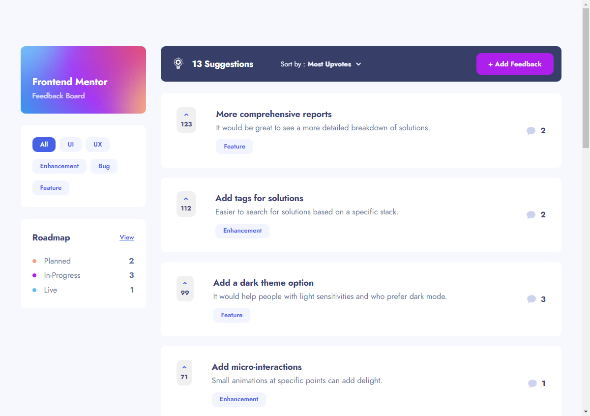
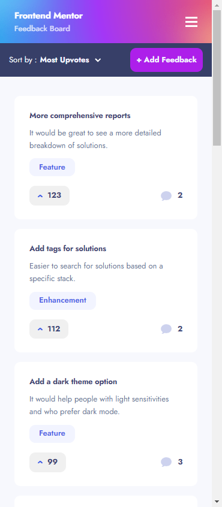
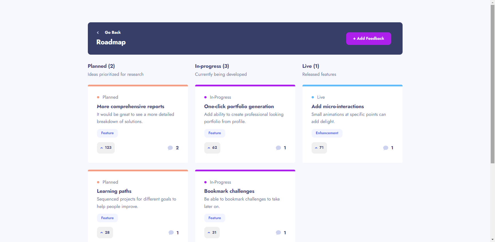
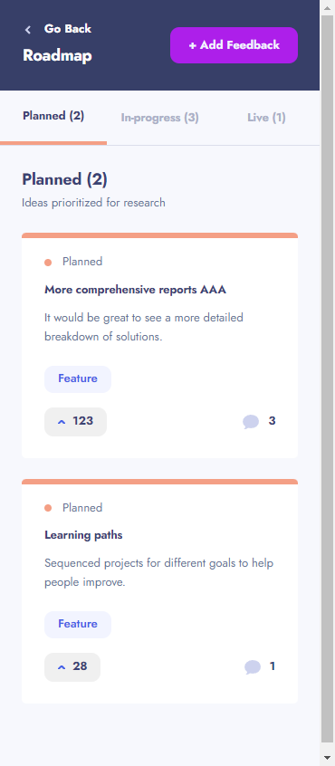
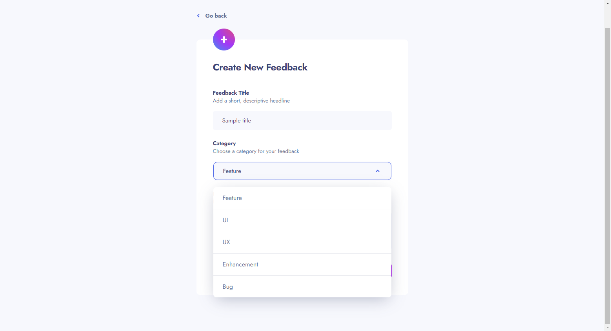
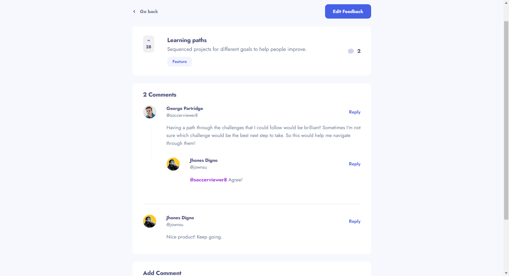

# Frontend Mentor - Product feedback app solution

This is a solution to the [Product feedback app challenge on Frontend Mentor](https://www.frontendmentor.io/challenges/product-feedback-app-wbvUYqjR6). Frontend Mentor challenges help you improve your coding skills by building realistic projects.

### The challenge

Users should be able to:

- View the optimal layout for the app depending on their device's screen size
- See hover states for all interactive elements on the page
- Create, read, update, and delete product feedback requests
- Receive form validations when trying to create/edit feedback requests
- Sort suggestions by most/least upvotes and most/least comments
- Filter suggestions by category
- Add comments and replies to a product feedback request
- Upvote product feedback requests
- **Bonus**: Keep track of any changes, even after refreshing the browser (`localStorage` could be used for this if you're not building out a full-stack app)

### Screenshot

### Links

- Solution URL: [Product feedback app](https://product-feedback-app-eta.vercel.app/)

### Built with

- HTML5
- SASS/SCSS
- [Redux Toolkit](https://redux-toolkit.js.org/) - The official, opinionated, batteries-included toolset for efficient Redux development.
- [React Hook Form](https://react-hook-form.com/) - Performant, flexible and extensible forms with easy-to-use validation.
- [React Bootstrap](https://react-bootstrap.github.io/) - React-Bootstrap replaces the Bootstrap JavaScript. Each component has been built from scratch as a true React component, without unneeded dependencies like jQuery.
- [React Responsive](https://www.npmjs.com/package/react-responsive) - Media queries in react for responsive design.

## Author

- Website - [Jownsu](https://jownsu.github.io/)
- Frontend Mentor - [@jownsu](https://www.frontendmentor.io/profile/jownsu)
- Instagram - [jownsu](https://www.instagram.com/jownsu/)
- Linked In - [Jhones](https://www.linkedin.com/in/jhones-digno-866904213/)
